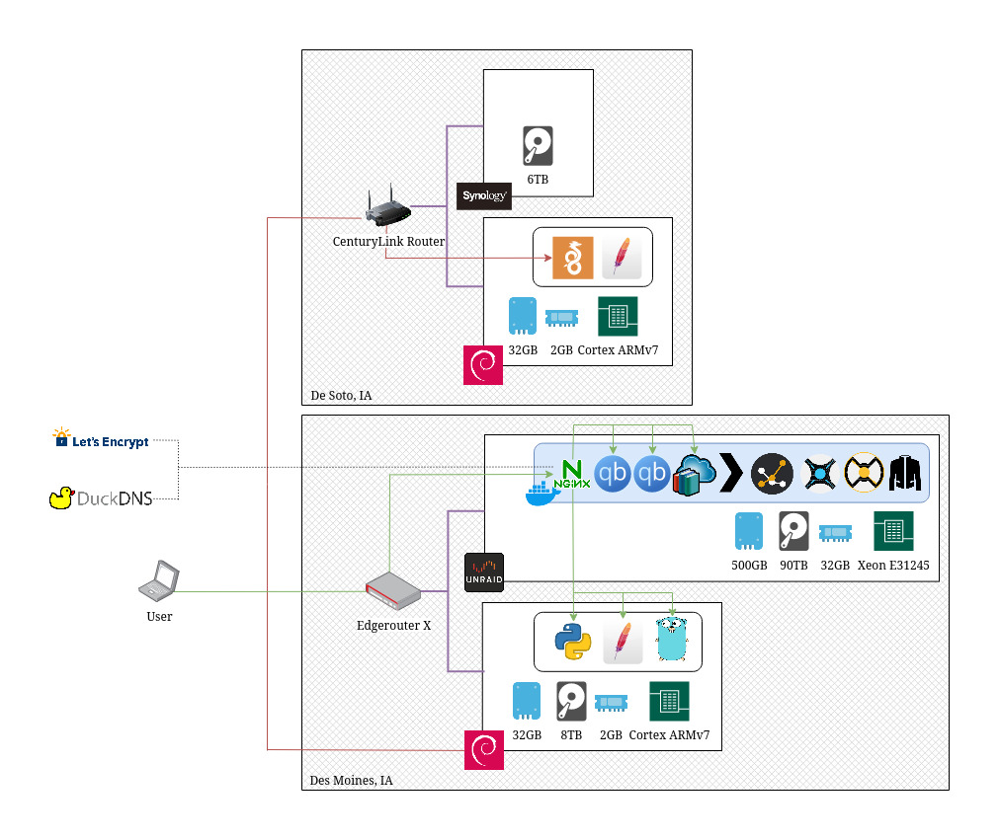
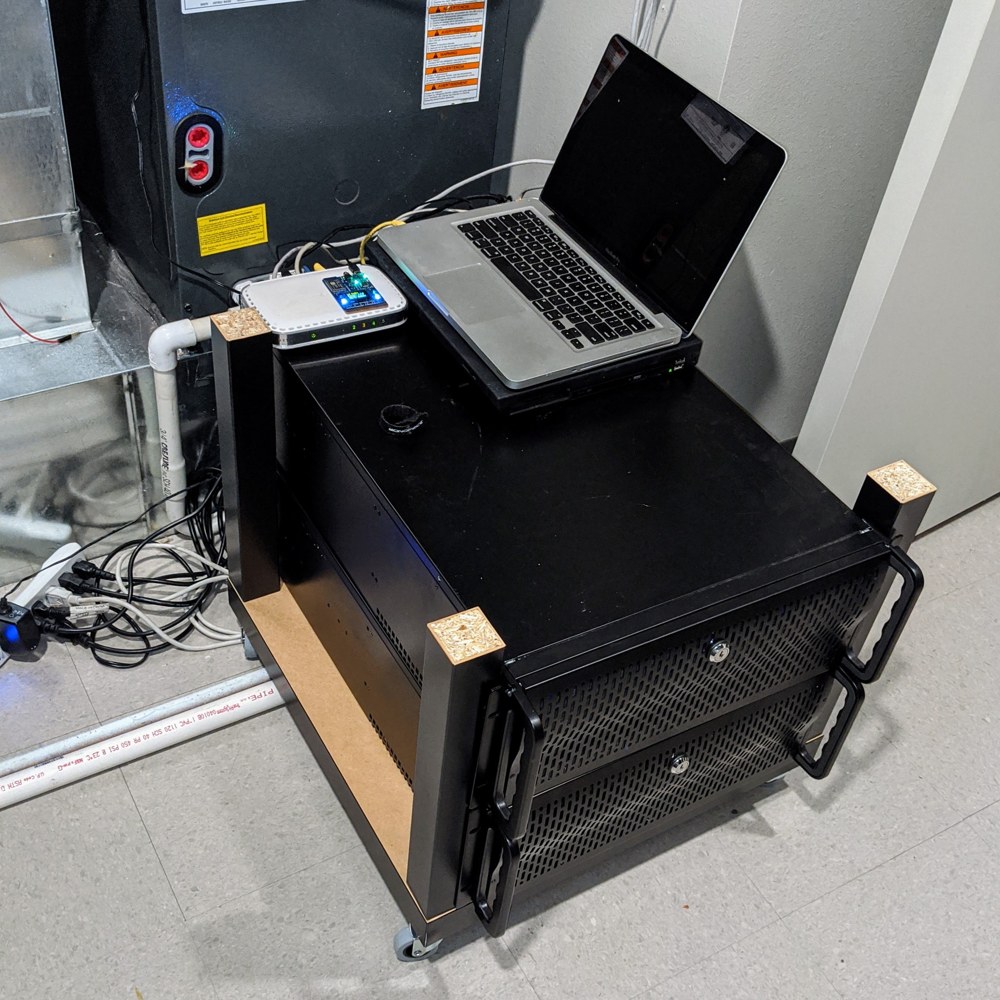

## Riley Snyder

### Intro

* Name: `Riley Snyder`

* Age: `24`

* Location: `Des Moines, Iowa`

* Occupation: `(AWS) Software Developer @ Principal Financial Group (~3yrs)`

* Things I'm Good At: `Python, Bash, Networking, Terraform, AWS`

* Things I'm Getting Better At: `Go, Javascript`

* Interests: `Storage, Networking, Watching TV, John Mayer`

* Computer: `Thinkpad`

* Keyboard: `Poker II`

* Mouse: `MX Master III`

* Monitor: `Ultrawide`

* Editor: `VS Code (or Vim)`

* Servers: `Too Many`

* OS: `Debian`

* Diet: `Pescetarian`

* Pet: `Louie (Dog, Mut)`

* Favorite Movie: `Planet of the Apes (1969)`

* Favorite Show: `True Detective (S01)`

* Favorite Food: `Anything With Cheese`

### 05/28/2020 - Pre-Move Lab

Since I am moving apartments this week, I thought I would take the opportunity to do a small write up on the status of my lab as it stands pre-move. I won't go into too much detail, and I will exclude adding all the boring IoT and personal devices connected to my network as they don't really contribute to my lab functions.

The entrypoint of my network is a Ubiquiti Edgerouter X. I chose this particular model because with my short list of non-negotables this was the one device that fit the bill. Router+Switch combination, PoE capable, 5 port, and part of the ubiquity ecosystem. It works alright, I think if I had to do it again I might pick a different setup, possibly a separate router and switch as the router UI is not too great on the edgerouter series, even now that I have had some time to get used to it.

The one PoE device I have is my access point, an old ubiquity that I got used off reddit (where I get most of my hardware from). It does its job fine, I only really use wifi for my phone/laptop/google-home devices so speed isn't crucial.

Now we get to the heart of my lab, my unRaid storage server. This setup has evolved many times over the 5 years I have been running it. It started off as an ubuntu 12 server running RAID 5 with three 4TB disks. I then discovered the pain of expanding small arrays, and found unRaid. The main benifit of unRaid is that you can add random disks on the fly as long as they are equal or less capacity than your parity drives. For example my two parity drives (allows for two disk failures with no data loss) are 10TB, and I have a mix of 10/8TB drives for data storage and the ability to add when I need more space. This was key as I expanded my data collection and could grab drives as they went on sale. Currently sitting at 90TB (down from 100TB) I am almost full with about 3TB to spare.

Another benifit of unRaid is that data is not striped, meaning that in the event that enough disks fail where a rebuild is not possible (three or more) I only lose the data on the disks that failed. The disks in the array simply have an XFS filesystem and can be yanked out and plugged into another linux system to have the data pulled off. This has saved me a few times when a disk "failed" durring a data rebuid, but I was able to rescue most of the data off the lost disks and simple copy the data back onto the surviving disks. I cannot reccomend unRaid enough, I dont think I will ever settle for striped data setup after this.  

All of my drives are shucked from Best Buy, WD White label (some red) easystores. These are (super cheap) external drives that when taken apart, contain white label drives (re-branded red drives). The 8TB ones can be had for as little as $140 while the best value per gig is 14TB for $200. Although that price is seen very rarely and I have been waiting patiently to pick three or more up next time they lower down to that price. I have never had an easystore fail me in 6 years so I am confident that they continue to be a good choice. They are currently in a few 4U Roswell chassis so I have plenty of room to expand when the time comes.

The unRaid server runs most of my personal services. Mainly Plex, but also the many services that make Plex work as automated as it can. A few bittorrent clients for downloading media, fed by sonarr (TV) and radarr (Movies), fed by Jackett (RSS). Tautuli captures data from plex for easy stats over time. Ubooquity for serving up all my ebooks and audiobooks. Finally, NGINX and LetsEncrypt serve the frontend for all my services. They provide easy SSL certificate renewal and termination so I don't have to worry about it from inside my network. All of the services on my unRaid box run via docker. unRaid comes with a great implementation of a docker UI that makes it painless to spin up services and use templates created by the community.

To host my external services, I have a small ODroid HC2 with a single 8TB disk. It runs a variety of web applications, some simple HTML via httpd, and others using python or golang (I am in the process of rewriting all my python code to go). I have a soft spot for single board ARM devices, although I phased most out and am just left with this one at the moment. I do have plans to move most of these services to their own VM on a proxmox box I am building, but that will have to wait until after the move. Currently the only "real" service I have running is my [plex request site](https://request.thecornelius.duckdns.org/), which is my first real go project.

For backups, I used to replicate everything to an unlimited g suite google drive, but I decided that my $12/month could be better spent elsewhere (and all this data wasn't mission critical anyway). I was lucky enough to be gifted an old Synology box (thanks Jeremy!) so I set that up at my parents house and use a raspberry pi 3 and pivpn to connect the ODroid to their network to allow me to back up my personal files (as well as sync my parents local data back to the unRaid box).

This setup is pretty simple, it serves many users and is as hands off as I want it to be. I have had to deal with a few scary disk failures (never buying seagate again) but unRaid has proven resilient and worth every penny (I actually paid for software if you can believe it). I will continue to mature this setup as I get more into web development and writing my own services for my users. I try not to think about how much money this has all cost me, but I never buy anything new (except the drives) and get lots of hardware from a local office I do occasional IT work for. In the end it has provided me with lots of fun(?) times making everything work together, and also I just get a kick out of having this much local storage.

